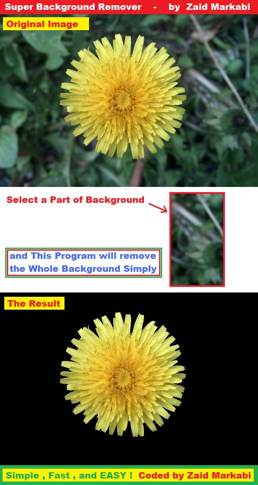



## a Super Image Background Remover

### Description

SEE SCREENSHOT.

This code let you to Remove Background of Image by selecting a Part of This Background.

then the application will remove the Whole Background automatically.

Very Easy tool, Fast Simple ans Powerful to Extract Objects from images.
 
### More Info
 

             |
---                |---
**Submitted On**   |2010-09-19 18:30:02
**By**             |[Zaid Markabi](https://github.com/Planet-Source-Code/PSCIndex/blob/master/ByAuthor/zaid-markabi.md)
**Level**          |Beginner
**User Rating**    |5.0 (15 globes from 3 users)
**Compatibility**  |VB 5\.0, VB 6\.0
**Category**       |[Graphics](https://github.com/Planet-Source-Code/PSCIndex/blob/master/ByCategory/graphics__1-46.md)
**World**          |[Visual Basic](https://github.com/Planet-Source-Code/PSCIndex/blob/master/ByWorld/visual-basic.md)
**Archive File**   |[a\_Super\_Im2188519192010\.zip](https://github.com/Planet-Source-Code/zaid-markabi-a-super-image-background-remover__1-73447/archive/master.zip)

